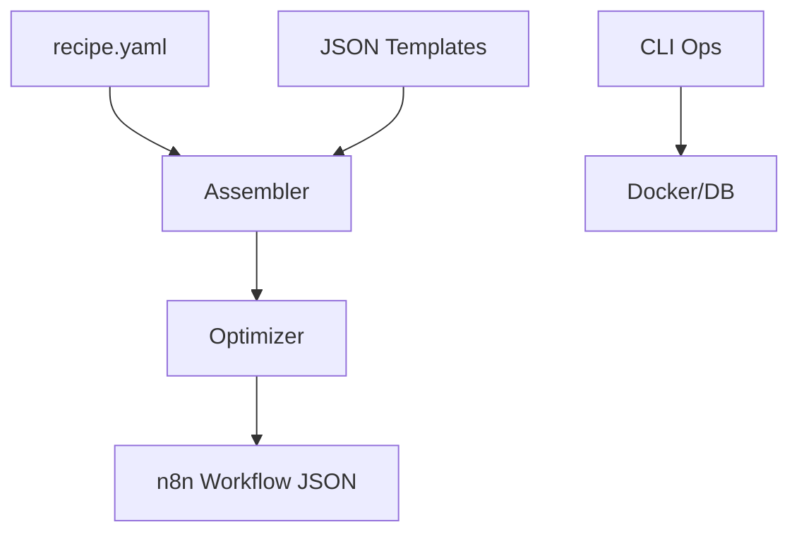

# n8n-factory

[](https://github.com/username/n8n-factory/actions/workflows/ci.yml)
[](https://opensource.org/licenses/MIT)

**n8n-factory** is a robust "Infrastructure as Code" (IaC) tool for assembling, optimizing, simulating, and publishing [n8n](https://n8n.io/) workflows. It allows you to define complex workflows using simple, composable YAML "recipes" and reusable JSON templates.

Designed for AI agents and power users who need deterministic workflow generation.

## Features

- **🏭 Assembly:** Compile YAML `recipes` into valid n8n `workflow.json` files.
- **🧩 Templates:** Massive library (80+) of reusable node templates.
- **🔍 Validation:** Detects circular imports, orphan nodes, and potential secrets.
- **🚀 Optimization:** Automatically merges nodes, prunes dead code, and standardizes JSON structure.
- **🛡️ Hardening:** Inject error triggers and debug logging automatically.
- **🎮 Simulation:** Dry-run workflows locally with mock data.
- **⚙️ Operations:** Manage Docker, Postgres, and Redis directly via CLI.
- **📦 Bundle & Publish:** Export to ZIP or upload directly to your n8n instance API.

## Installation

```bash
pip install n8n-factory
```

## Quick Start

1.  **Initialize:** `n8n-factory init`
2.  **Create Recipe:** Edit `recipes/my_workflow.yaml`.
3.  **Build:** `n8n-factory build recipes/my_workflow.yaml`

## CLI Reference

- `build`: Assemble recipe to JSON.
- `list`: Show available templates (`--json`).
- `ops`: Runtime operations (`logs`, `db`, `redis`, `exec`).
- `normalize`: Standardize JSON structure.
- `optimize`: Refactor and clean up workflows.
- `harden`: Inject debug logging and error handling.
- `simulate`: Run logic locally.
- `diff`: Compare recipe vs JSON.

See `n8n-factory --help` for all commands.

## Architecture



## Contributing

See [CONTRIBUTING.md](CONTRIBUTING.md).

## License

MIT