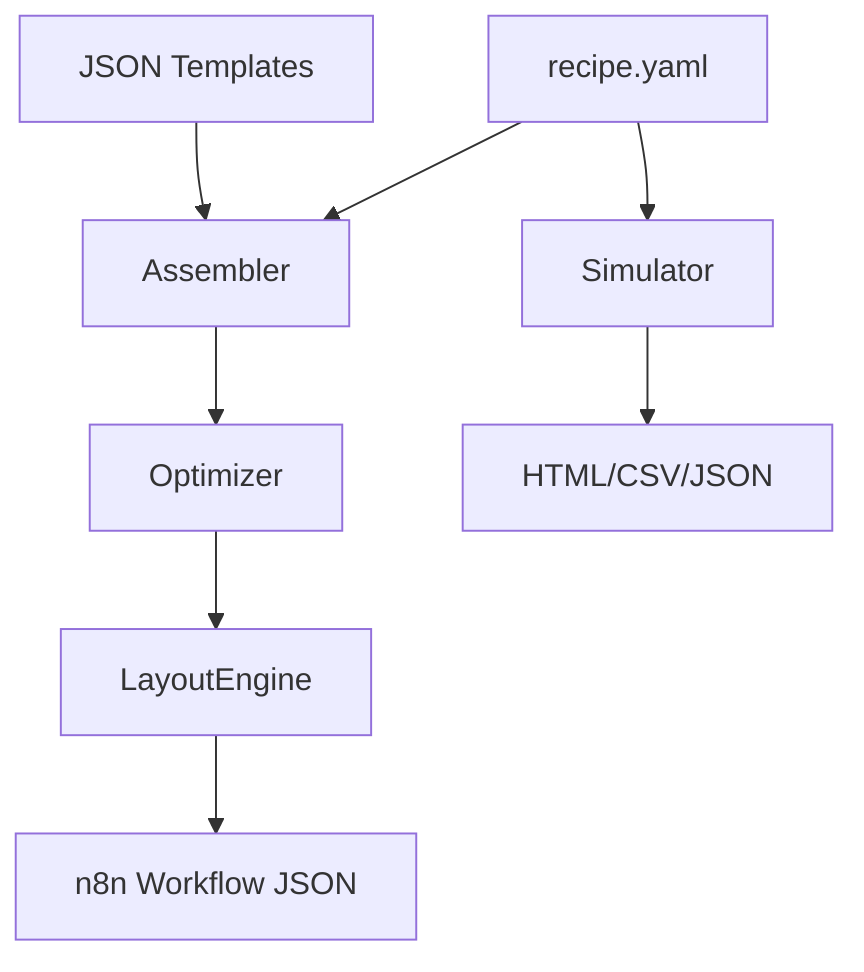

# n8n-factory

[](https://github.com/username/n8n-factory/actions/workflows/ci.yml)
[](https://opensource.org/licenses/MIT)

**n8n-factory** is a robust "Infrastructure as Code" (IaC) tool for assembling, optimizing, simulating, and publishing [n8n](https://n8n.io/) workflows. It allows you to define complex workflows using simple, composable YAML "recipes" and reusable JSON templates.

Designed for AI agents and power users who need deterministic workflow generation.

## Features

- **🏭 Assembly:** Compile YAML `recipes` into valid n8n `workflow.json` files.
- **🧩 Templates:** Massive library (80+) of reusable node templates including AI (Ollama, Pinecone), DevOps (AWS, GitHub), and SaaS (Slack, HubSpot).
- **🔍 Validation:** Detects circular imports, orphan nodes, unused variables, and potential secrets.
- **🚀 Optimization:** Automatically merges `set` nodes, prunes dead code, and folds constants.
- **🎮 Simulation:** Dry-run workflows locally with mock data, latency simulation, breakpoints, and assertions.
- **🕸️ Auto-Layout:** Automatically positions nodes in the n8n canvas.
- **📦 Bundle & Publish:** Export to ZIP or upload directly to your n8n instance API.
- **🔧 Developer Tools:** Linting, diffing, visualization (Mermaid/ASCII), and extensive CLI.

## Installation

```bash
pip install n8n-factory
```

Or from source:

```bash
git clone https://github.com/username/n8n-factory.git
cd n8n-factory
pip install -e .
```

## Quick Start

1.  **Initialize a new recipe:**
    ```bash
    n8n-factory init
    ```

2.  **Edit `recipes/my_workflow.yaml`:**
    ```yaml
    name: "My First Workflow"
    steps:
      - id: "start"
        template: "webhook"
        params: { path: "hello", method: "GET" }
      - id: "ai"
        template: "ollama_chat"
        params: { prompt: "Hello world" }
    ```

3.  **Build it:**
    ```bash
    n8n-factory build recipes/my_workflow.yaml
    ```

4.  **Visualize logic:**
    ```bash
    n8n-factory visualize recipes/my_workflow.yaml
    ```

## CLI Reference

- `build`: Assemble recipe to JSON.
- `simulate`: Run logic locally (supports `--interactive`, `--step`).
- `publish` / `run`: Upload to n8n (supports `--activate`).
- `list`: Show available templates.
- `search`: Find templates.
- `inspect`: View template details.
- `lint`: Check style/errors.
- `diff`: Compare recipe vs JSON or another recipe.
- `serve`: Host visualization locally.
- `watch`: Auto-rebuild on change.
- `template new`: Scaffold a new template.

See `n8n-factory --help` for all commands.

## Architecture



## Contributing

See [CONTRIBUTING.md](CONTRIBUTING.md) for details on setting up the dev environment and running tests.

## License

MIT
